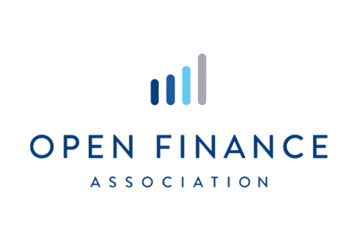

<div align="center">



# 🔥 FLAME FINANCE ADVANCED

**Platform analisis trading multi-aset — Crypto, Saham (US/IDX), Forex, Emas/Perak/Minyak**
Dilengkapi indikator teknikal, sinyal konfluensi, replay simulator, dan sistem lisensi premium.


</div>

---

## 📖 Tentang Project

**Flame Finance Advanced** adalah web app analisis pasar finansial yang berjalan **100% di sisi client** (static site, tanpa backend custom). Semua data realtime diambil langsung dari API publik, sementara autentikasi, lisensi premium, dan limit penggunaan dikelola lewat **Firebase**.

Cocok untuk trader yang butuh dashboard analisis cepat: chart + indikator, screener multi-aset, sinyal entry/SL/TP otomatis, sampai simulator replay market — semua dalam satu tempat.

---

## ✨ Fitur Utama

| Fitur | Deskripsi |
|---|---|
| 📊 **Dashboard** | Ringkasan pasar real-time — crypto, saham, forex, komoditas. Bebas akses, tanpa limit. |
| 📈 **Chart & Indicators** | Chart candlestick + 10+ indikator teknikal (SMA, EMA, RSI, MACD, Bollinger Bands, ATR, dll). |
| 🧠 **Analysis** | Analisis konfluensi multi-timeframe (MTF) dengan scoring otomatis dan setup trading (entry/SL/TP). |
| 🔍 **Screener** | Pemindai instrumen berdasarkan filter teknikal di seluruh watchlist. |
| 🧬 **Screen Analysis** *(Premium)* | Cari & analisis instrumen apapun secara bebas — mode **Trader** (entry/SL/TP) atau **Investor** (fundamental & valuasi). |
| ⏪ **Market Replay** *(Premium)* | Simulator trading berbasis data historis — drawing tools, multi-timeframe, balance virtual $10,000. |
| 📰 **News** | Agregator berita pasar finansial. Bebas akses, tanpa limit. |
| 👥 **Developer & Komunitas** | Hub komunitas & resource untuk pengguna. |
| 🖼️ **Export Chart** | Export chart + anotasi (Order Block, FVG, Fibonacci, Entry/SL/TP) ke PNG. |
| 🔐 **Sistem Lisensi** | Aktivasi premium via kode lisensi (7 hari / 30 hari / 1 tahun), generate kode dari Admin Panel. |
| ⏱️ **Limit Harian** | User gratis dibatasi 2x/hari untuk fitur tertentu (Chart, Analysis, Calculator, Screener); reset otomatis tiap hari (WIB). |
| 🛠️ **Admin Panel** | Kelola user, generate & pantau kode lisensi. |

---

## 🗂️ Bahasa & Teknologi

Project ini dibangun **tanpa framework/build-tool** — pure web stack, langsung jalan di browser:

| Layer | Teknologi |
|---|---|
| Markup | **HTML5** |
| Styling | **CSS3** (custom, tanpa framework CSS) |
| Logic | **JavaScript (Vanilla ES6+)**, modular via `window.*` namespace |
| Auth & Database | **Firebase Authentication** + **Firebase Realtime Database** (SDK v10, compat mode) |
| Rendering Chart | **Canvas2D API** (native, untuk export chart beranotasi) |

> Tidak ada Node.js/npm build step — cukup buka `index.html` lewat web server statis apapun.

---

## 🔌 Resource API

Semua data pasar diambil langsung dari browser ke API publik pihak ketiga (client-side fetch):

| Sumber Data | Untuk | Auth | Catatan |
|---|---|---|---|
| **Binance Global API** (`api.binance.com`) | Crypto OHLCV, ticker, order book + harga Emas/Perak/Minyak sintetik (XAUTUSDT dkk.) | Tidak perlu API key | Gratis, CORS terbuka |
| **Twelve Data API** | Saham US & IDX, Forex (time series & quote real) | **Perlu API key** | Free tier: ±800 request/hari, 8 request/menit. Hasil di-cache 45 detik di client. |
| **Yahoo Finance (endpoint internal)** | Fallback data saham Indonesia (IDX) | Tidak resmi | Bukan API publik resmi Yahoo — bisa berubah/berhenti tanpa pemberitahuan, dipakai sebagai fallback gratis. |
| **ExchangeRate-API** (`open.er-api.com`) | Kurs forex | Tidak perlu API key | Update ±1 jam sekali |
| **Alternative.me** | Crypto Fear & Greed Index | Tidak perlu API key | — |
| **CoinGecko API** | Data market crypto tambahan (market cap, global stats) | Tidak perlu API key | Ada rate limit |
| **RSS2JSON** (`api.rss2json.com`) | Konversi RSS feed berita finansial ke JSON | Tidak perlu API key | Dipakai oleh halaman News |

> ⚠️ **Catatan keamanan:** karena ini situs statis tanpa server, API key Twelve Data otomatis terlihat siapa pun yang membuka DevTools/Network tab. Key tersebut **read-only** (hanya baca data pasar), jadi risikonya sebatas kuota API "dipinjam" pihak lain — bukan kebocoran data pengguna. Untuk produksi yang lebih aman, sebaiknya proxy request lewat backend/serverless function sendiri.

---

## 🗄️ Database

Menggunakan **Firebase Realtime Database** (NoSQL, JSON tree) + **Firebase Authentication** (Email/Password).

### Struktur data

```
flamefinance-default-rtdb
├── users/
│   └── {uid}/
│       ├── email, username, role         # role: 'free' | 'premium' | 'admin'
│       ├── premiumUntil, premiumPlan
│       ├── deviceId, deviceLabel, deviceBoundAt   # info audit, bukan device-lock
│       ├── licenseUsed
│       ├── createdAt
│       └── usage/{YYYY-MM-DD}/{feature}  # counter limit harian (WIB)
│
└── licenses/
    └── {CODE}/                            # format: FLAME-XXXX-XXXX
        ├── duration                        # 7 | 30 | 365 (hari)
        ├── status                          # 'unused' | 'used'
        ├── createdAt, createdBy
        └── usedBy, usedByEmail, usedAt, deviceId
```

### Keamanan
- Aturan akses didefinisikan di [`database.rules.json`](./database.rules.json).
- User hanya bisa membaca/menulis profilnya sendiri, kecuali role `admin`.
- Perubahan role ke `premium` divalidasi server-side berdasarkan kode lisensi yang valid dan belum dipakai.
- Redeem kode lisensi memakai **Firebase Transaction** (atomic) — aman dari race condition jika 2 device redeem kode yang sama secara bersamaan.

---

## 📁 Struktur Folder

```
PREMIUM-F2/
├── index.html              # Entry point — dashboard utama (SPA router)
├── login.html               # Halaman login
├── register.html            # Halaman registrasi
├── premium.html              # Halaman upgrade premium
├── adminpanel.html           # Panel admin (kelola user & lisensi)
├── database.rules.json       # Aturan keamanan Firebase Realtime Database
├── logoku.png / qris.png     # Aset gambar (logo & QRIS pembayaran)
│
├── css/
│   ├── style.css              # Style utama aplikasi
│   └── auth-style.css         # Style halaman login/register
│
├── js/
│   ├── config.js               # Daftar instrumen (crypto/saham/forex) & endpoint API
│   ├── firebase-init.js        # Inisialisasi Firebase + konstanta app
│   ├── auth.js                  # Register, login, logout, status premium
│   ├── license.js               # Generate & redeem kode lisensi
│   ├── limits.js                  # Limit harian fitur untuk user free
│   ├── device-fingerprint.js      # ID perangkat untuk audit (bukan device-lock)
│   ├── api.js                      # Lapisan abstraksi pengambilan data pasar
│   ├── twelvedata.js                # Integrasi Twelve Data (saham & forex)
│   ├── yahoo-idx.js                  # Fallback data saham IDX
│   ├── gold-offset.js                 # Kalibrasi harga emas (Binance vs TradingView)
│   ├── indicators.js                   # Library indikator teknikal murni JS
│   ├── signals.js                       # Scoring konfluensi & generate setup trading
│   ├── analysis.js                       # Logika halaman Analysis
│   ├── chart.js / chart-export.js         # Render & export chart
│   ├── ui.js                                # Utilitas UI global (toast, dark mode, dst.)
│   └── admin.js                              # Fungsi khusus Admin Panel
│
└── pages/                    # Halaman fragment yang dimuat SPA router
    ├── dashboard.html
    ├── chart.html
    ├── analysis.html
    ├── screener.html
    ├── screenanalysis.html    # Premium
    ├── replay.html             # Premium
    ├── news.html
    └── devcom.html
```

---

## 🚀 Cara Menjalankan

Karena tidak ada build step, cukup serve folder ini sebagai static site:

```bash
# Opsi 1 — Python
python3 -m http.server 8080

# Opsi 2 — Node (http-server)
npx http-server -p 8080

# lalu buka:
http://localhost:8080/index.html
```

> 💡 Pastikan koneksi internet aktif karena semua data pasar diambil langsung dari API eksternal saat runtime.

---

## 👑 Role & Lisensi

| Role | Akses |
|---|---|
| **Free** | Dashboard & News tanpa limit. Chart/Analysis/Calculator/Screener: **2x per fitur/hari**. Tidak bisa akses fitur Premium Exclusive. |
| **Premium** | Semua fitur unlimited + akses eksklusif: Screen Analysis, Replay, Compare. Aktif sampai `premiumUntil`. |
| **Admin** | Akses penuh tanpa batas + Admin Panel (kelola user, generate kode lisensi). |

Paket lisensi: **7 Hari**, **30 Hari**, **1 Tahun** — diaktivasi lewat redeem kode (format `FLAME-XXXX-XXXX`) yang digenerate dari Admin Panel.

---

<div align="center">

Made with 🔥 — **Flame Finance Advanced**

</div>
